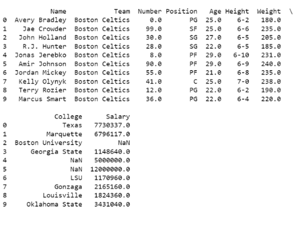

# Read-from-CSV

## AIM:

## ALGORITHM:
### Step 1:
### Step 2:
### Step 3:
### Step 4:
### Step 5:

## PROGRAM:
```
import pandas as pd
f=pd.read_csv('/contant/nba.csv')
print(f.head(10))
print(f.tail())
print('row:',len(f.axes[0]))
print('col:',len(f.axes[1]))
```
## OUTPUT:


## RESULT:
the program is sucssessful